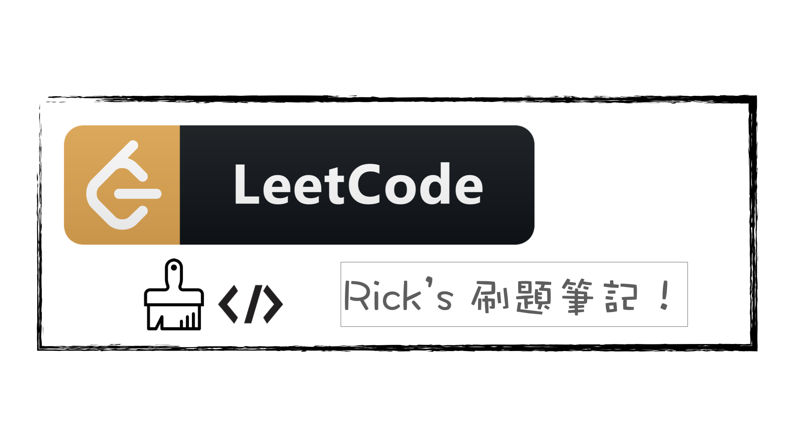
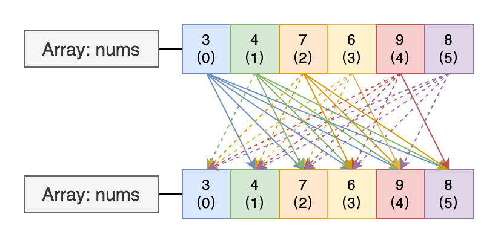

# Leetcode 1. Two Sum



---

刷題筆記：「Two Sum」，挑兩個加總！

---

## 正文

### 題目：[Two Sum](https://leetcode.com/problems/two-sum/)

### 難度：Easy

### 題目說明

題目會給我們一個整數陣列「`nums`」和一個整數「`target`」，然後要求我們在該整數陣列中找尋找任意兩個總和等於「`target`」的元素並返回包含該兩個元素索引值的整數陣列。

此外，題目還說，我們可以假設每次的輸入僅會存在一組有效答案，並且該答案不允許重覆使用同樣的元素。

###### 限制

- 2 ≤ nums.length ≤ 10²
- -10⁹ ≤ num\[i\] ≤ 10⁹
- -10⁹ ≤ target ≤ 10⁹
- 僅存在一組有效答案。

### 題目解析

#### 方式一、暴力演算法

##### 建議解答

```java
class Solution {
    public int[] twoSum(int[] nums, int target) {
        for (int i = 0; i < nums.length - 1; i++)
            for (int j = i + 1; j < nums.length; j++)
                if (nums[i] + nums[j] == target) return new int[]{i, j};
        return null;
    }
}
```

##### 說明

對這題來說，最直觀的解題方式就是「暴力演算法」，而其作法當然就是將所有的「可能組合」都逐一嘗試，示意圖如下：



如上圖，其「每條線」都代表一種組合的可能，而為了要遍歷所有的可能組合，所以我們會採用「雙層迴圈」的結構，先透過外層迴圈將陣列中的元素逐一固定，然後再藉由進行「總和」的比對，而具體的做法就如上示意圖所示，我們會先將「藍（3）」元素固定，然後遍歷陣列中其它的元素，倘若在遍歷完成後仍未出現「總和」符合「`target`」的元素組，我們就會將固定的元素從「藍（3）」移往「綠（4）」，並同樣執行遍歷陣列中其它元素的行為，以此類推，直到出現「總和」等於「`target`」的組合出現。

接著就是程式碼的實作，就如先前所述，我們是採用「雙層迴圈」的結構，先以「外層迴圈」固定一個陣列元素，再以「內層迴圈」來達到逐一遍歷的效果，如此一來，基本的程式雛形就已經完成了，但要注意，由於題目有說，禁止使用重覆的元素，所以我們必須在「內層迴圈」上多加上一層判斷，要去排除使用重覆元素的情況，完整程式碼如下：

```java
class Solution {
    public int[] twoSum(int[] nums, int target) {
        for (int i = 0; i < nums.length - 1; i++)
            for (int j = 0; j < nums.length; j++) {
                if (i == j) continue;
                if (nums[i] + nums[j] == target) return new int[]{i, j};
            }
        return null;
    }
}
```

雖然說上述的程式碼已經可以正確執行，也可以通過「Leetcode」的檢驗，但其實它有一個邏輯上的瑕疵：它沒有排除「順序對換」的組合。

什麼意思呢？

事實上，因爲題目的要求是「總和」，也就是「加法」計算，所以其前後順序並不會影響計算後的結果，舉例來說，如示意圖中的「藍（3）」和「綠（4）」，其總和會等同於其反向組合，也就是「綠（4）」和「藍（3）」的總和；換句話說就是，當我們計算過「藍（3）」和「綠（4）」後，其實就不需要再去計算「綠（4）」和「藍（3）」，如此一來，我們就可以減少一半的計算次數，在示意圖中，我們以「實線」和「虛線」表示其互為「順序相反」的關係；而在程式碼實作上，我們只要將「內層迴圈」的起始點從「`0`」改為「`i + 1`」即可，完整程式碼如下：

```java
class Solution {
    public int[] twoSum(int[] nums, int target) {
        for (int i = 0; i < nums.length - 1; i++)
            for (int j = i + 1; j < nums.length; j++)
                if (nums[i] + nums[j] == target) return new int[]{i, j};
        return null;
    }
}
```

#### 方式二、映射法

##### 建議解答

```java
class Solution {
    public int[] twoSum(int[] nums, int target) {
        Map<Integer, Integer> map = new HashMap<>();
        for (int i = 0; i < nums.length; map.put(target - nums[i], i++))
            if (i != 0 && map.containsKey(nums[i]))
                return new int[]{i, map.get(nums[i])};
        return null;
    }
}
```

##### 說明

根據先前的介紹，我們知道「暴力演算法」的實作程式碼是以「雙層迴圈」來達到「遍訪」所有可能組合的目的，簡單既粗暴。

而現在要介紹的「映射法」，其解題思路就與「暴力演算法」不同，它是利用「Map」的「資料結構」來完成題目的要求；但別以為其有多特別，事實上，「暴力演算法」與「映射法」，兩者的「原理」並沒有太大的差別。

話不多說，我們先來看一下「映射法」的解題方式，首先，它會利用「Map」的「鍵值結構」來建立一個可用於比對的「樣版」；樣板的建立規則是以「陣列的索引值」作為「鍵值結構」中的「值」，再以「陣列的值」作為「鍵值結構」中的「鍵」，示意圖如下：


在建立樣板以後，我們就可以藉由關鍵的方法：「[`containsKey(Object key)`](https://docs.oracle.com/en/java/javase/11/docs/api/java.base/java/util/HashMap.html#containsKey(java.lang.Object))」，以之來達到搜尋目標的目的，程式碼如下：

```java
class Solution {
    public int[] twoSum(int[] nums, int target) {
        Map<Integer, Integer> map = new HashMap<>();
        for (int i = 0; i < nums.length; map.put(target - nums[i], i++))
            if (i != 0 && map.containsKey(nums[i]))
                return new int[]{i, map.get(nums[i])};
        return null;
    }
}
```

因為我們在製作樣板時，是將「陣列元素的值」作為「Map」的「鍵」，也就是說，只要「Map」的「鍵」中，存在一個「鍵」的數值與當前元素的值之總和為「`target`」，那麼這兩個元素就是題目所要求的答案，接著，我們就只要兩者的索引值返回就可以了。

這思路很有趣，但實際上，就如剛才所說，「映射法」與「暴力演算法」的原理相當類似，若將之與「暴力演算法」的程式碼相比，就會發現兩者的結構有一定程度上的相似，譬如「映射法」中的「迴圈」與「暴力演算法」中的「外層迴圈」的目的是相同的，都是在固定一個陣列中的元素，只是「映射法」多了一個將原本元素放到「Map」裡的動作，而該動作的目的就是在建立比對用的「樣版」。

事實上，「暴力演算法」與「映射法」最大的差別在於「內層迴圈」，在「暴力演算法」中，「內層迴圈」是在進行「總和」的比對；而「映射法」的「內層迴圈」，咦，「映射法」沒有「內層迴圈」啊？

是的，因為「映射法」的「內層迴圈」被「`Map.containsKey(Object key)`」替代。

但各位讀者有沒有想過「`Map.containsKey(Object key)`」的實作內容是什麼？

因爲「`Map.containsKey(Object key)`」只是個介面方法，所以實作內容會在其實現類別，而本文中，我們所使用的類別是「HashMap」，所以我們要參考的實作內容在「[`HashMap.containsKey(Object key)`](https://github.com/rickbsr/Java-Src/blob/main/temurin-11.0.17/src/java.base/java/util/HashMap.java#L591)」，其關鍵程式碼在「[`HashMap.getNode(int hash, Object key)`](https://github.com/rickbsr/Java-Src/blob/main/temurin-11.0.17/src/java.base/java/util/HashMap.java#L563)」，內容如下：

```java
/**
 * Implements Map.get and related methods.
 *
 * @param hash hash for key
 * @param key the key
 * @return the node, or null if none
 */
final Node<K,V> getNode(int hash, Object key) {
    Node<K,V>[] tab; Node<K,V> first, e; int n; K k;
    if ((tab = table) != null && (n = tab.length) > 0 &&
        (first = tab[(n - 1) & hash]) != null) {
        if (first.hash == hash && // always check first node
            ((k = first.key) == key || (key != null && key.equals(k))))
            return first;
        if ((e = first.next) != null) {
            if (first instanceof TreeNode)
                return ((TreeNode<K,V>)first).getTreeNode(hash, key);
            do {
                if (e.hash == hash &&
                    ((k = e.key) == key || (key != null && key.equals(k))))
                    return e;
            } while ((e = e.next) != null);
        }
    }
    return null;
}
```

原始碼來源為「[Eclipse Temurin™](https://adoptium.net/temurin/)」，發行版本為「11.0.17」。

看到了嗎？

其實它的實作也同樣是個迴圈，所以，筆者先前才會說「暴力演算法」與「映射法」的原理相當類似，事實上，就這個角度而言，兩者的確是相同的。

但兩者還是有區別的，事實上，若你將本文中兩個解法的程式碼分別執行，那麼你可能會發現，兩者的運行效率存在明顯差異，而導致該現象的最主要原因其實是「HashMap」本身的特性，不過由於本文的主題是「Leetcode」的解題，所以有關於「HashMap」的實作原理、原始碼就不過多著墨。

事實上，「HashMap」的原始碼、實作原理是「Java」面試時的常見考題，未來有機會的話，筆者會考慮另闢戰場。

## 參考資料

- [Oracle Java® Platform, Standard Edition & Java Development Kit Version 11 API Specification](https://docs.oracle.com/en/java/javase/11/docs/api/)
- [Adoptium, Eclipse Temurin™](https://adoptium.net/temurin/)
- [Eclipse Adoptium - GitHub](https://github.com/adoptium)